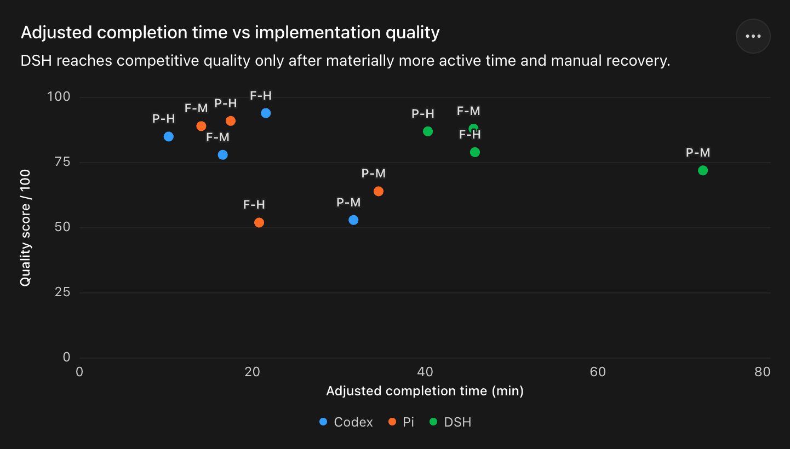

# DeepSeek CLI Harness Benchmark

This repository is a reproducible benchmark bundle for comparing CLI harnesses
running the same DeepSeek models and reasoning tiers. It contains the canonical
prompt, raw Pi/Codex/DSH session metadata, generated implementations,
browser-reviewed quality evidence, normalization scripts, and two self-contained
HTML reports.

The included launcher prepares isolated case directories and prints interactive
CLI commands; it does not launch a terminal, submit the prompt, or monitor the
process. The reviewed runs committed under `runs/` were captured separately and
are preserved as benchmark evidence.

## Reports

1. [DeepSeek CLI Harness benchmark report](output/pdf/deepseek-cli-harness-report/report.html) — the primary Pi vs Codex vs DSH comparison across completion time, one-shot completion, input/cache behavior, tool failures, and implementation quality.
2. [DSH preview CLI recommendations](output/pdf/dsh-preview-cli-recommendations/report.html) — a focused, friendly review of DSH's recovery semantics, capability negotiation, tool contracts, visual validation, and observability roadmap.

Both reports are delivered as self-contained HTML. Their reviewed
`artifact.json` payloads and `verification.md` records live beside each report;
PDF copies are intentionally not retained.



`F/P` means DeepSeek V4 Flash/Pro, `H/M` means high/max reasoning effort, and
color identifies the CLI harness. DSH adjusted time excludes explicit
disconnect and retry waits; use the primary report for definitions and caveats.

## Evidence and metadata map

The JSONL session logs are the primary run metadata. The report artifacts are
reviewed projections of this evidence, not replacements for it.

| Evidence layer | Primary location | Purpose |
| --- | --- | --- |
| Canonical prompt | [`prompts.md`](prompts.md) | Shared input used by every reviewed case. |
| Pi session metadata | `runs/<timestamp>/<case>/.benchmark-runtime/pi/sessions/*.jsonl` | Model messages, tool calls/results, token/cache usage, and timing events. |
| Codex session metadata | `runs/<timestamp>/<case>/.benchmark-runtime/codex/sessions/**/*.jsonl` | Rollout events, tool outcomes, token/cache usage, and timing events. |
| DSH session metadata | `runs/dsh/<case>/session.jsonl` | Turn lifecycle, retries, sandbox changes, tool calls/results, and usage data. |
| Generated evidence | `runs/<timestamp>/<case>/` and `runs/dsh/<case>/` | HTML implementations, Pi session exports, and DSH preview images. |
| Normalized case metrics | [`analysis/analyze-runs.mjs`](analysis/analyze-runs.mjs) | Reconciles the three session schemas into comparable case-level metrics. |
| Quality review | [`analysis/quality-assessment.md`](analysis/quality-assessment.md) | Browser-reviewed rubric, critical defects, and scoring rationale. |
| DSH failure audit | [`analysis/audit-dsh-errors.mjs`](analysis/audit-dsh-errors.mjs) | Reconciles harness-declared failures with non-zero exits and runtime exceptions. |
| Report queries | [`analysis/report-source.sql`](analysis/report-source.sql) and [`analysis/harness-summary.sql`](analysis/harness-summary.sql) | Reviewed case and harness materializations used by the main report. |

## Prompt provenance and acknowledgements

The canonical prompt in [`prompts.md`](prompts.md) comes from
[awesome-llm-benchmark-prompts](https://github.com/karminski/awesome-llm-benchmark-prompts),
specifically its
[3.5-inch floppy-disk exploded-view prompt](https://github.com/karminski/awesome-llm-benchmark-prompts/blob/main/instruction/prompt-complex-frontend-floppydisk.md),
published as `CC-BY-NC-SA 4.0 by karminski-牙医`. Many thanks to 牙医 for
creating and openly sharing this rigorous benchmark prompt.

## A note for DSH

DSH could learn from Pi's
[AgentHarness implementation specification](https://github.com/earendil-works/pi/blob/main/packages/agent/docs/harness.md)
and publish a similarly explicit harness contract. That would give contributors
a clear development roadmap and help align the upper-layer design before
implementation details harden.

## Run

Install the harnesses you want to compare. Claude Code can be installed with
`npm install -g @anthropic-ai/claude-code`; Claude cases also use the existing
Pi DeepSeek credential through Pi's credential helper.

Paste the benchmark prompt into `prompts.md`, then prepare a timestamped run:

```bash
./prepare.sh
```

This creates `runs/YYYYMMDDHHMMSS/prompts.md` and records that directory as the
current run. Generate a command for one case:

```bash
./run-case pi-flash-high
```

`run-case` creates an empty `runs/YYYYMMDDHHMMSS/<case>/` directory and prints
one shell command. Copy that command into any terminal. When the interactive
CLI is ready, paste the contents of the displayed `prompts.md` path manually.
The command keeps the normal user `HOME` but confines all filesystem writes to
the case directory with macOS Seatbelt.

Repeat `run-case` while its case directory is empty to print the same command
again. Once the directory contains output, prepare a new timestamped run rather
than reusing the sample.

An explicit prompt file or stdin can also be used:

```bash
./prepare.sh /absolute/path/to/prompt.md
pbpaste | ./prepare.sh -
```

## Cases

- `pi-flash-high`
- `pi-flash-max`
- `pi-pro-high`
- `pi-pro-max`
- `codex-ds-flash-high`
- `codex-ds-flash-max`
- `codex-ds-pro-high`
- `codex-ds-pro-max`
- `claude-ds-flash-high`
- `claude-ds-flash-max`
- `claude-ds-pro-high`
- `claude-ds-pro-max`

## Launch configuration

Commands use the normal user `HOME`, so Keychain and normal shell behavior are
unchanged. Harness state is redirected to
`<case>/.benchmark-runtime/{pi,codex,claude}`, and `TMPDIR`, `TMP`, `TEMP`, XDG cache,
npm, pip, uv, and Playwright paths are redirected below
`<case>/.benchmark-runtime/`. There is no benchmark-specific system or
developer prompt.

Pi explicitly disables extensions, skills, prompt templates, themes, context
files, and project-local approval resources. Its credential is resolved once
through Pi's own auth command before launch and passed only to the sandboxed
process; settings, model caches, and sessions remain case-local. The host's
`~/.pi/agent/settings.json` and `auth.json` are never writable.
Codex uses the existing `deepseek` profile through a case-local `CODEX_HOME`,
overrides model and reasoning effort on the command line, disables project
instruction ingestion and optional integrations, and does not load the host
`config.toml` or its MCP server definitions. Its profile is copied into the
case instead of symlinked, so TUI persistence cannot reach the host profile.
The detected Git root is pre-marked trusted only in the disposable base config
to skip the startup trust prompt; the outer Seatbelt still prevents writes
outside the case. No incomplete MCP overrides are generated in the clean
runtime.

Claude Code uses DeepSeek's Anthropic-compatible endpoint and a case-local
`CLAUDE_CONFIG_DIR`. It launches with `--bare`, an explicit empty MCP config,
slash skills disabled, Chrome disabled, and nonessential network traffic
disabled. The selected DeepSeek model and effort are set in both the documented
environment variables and CLI flags. The API token is resolved through Pi's
credential helper before launch and scrubbed from Claude's tool subprocesses.
The environment follows DeepSeek's
[Claude Code integration guide](https://api-docs.deepseek.com/zh-cn/quick_start/agent_integrations/claude_code/),
while isolation flags follow the current
[Claude Code CLI reference](https://code.claude.com/docs/en/cli-usage).

All three harnesses run in YOLO mode. Pi's built-in tools execute directly;
Codex uses `--dangerously-bypass-approvals-and-sandbox`, and Claude Code uses
`--dangerously-skip-permissions`. An outer macOS Seatbelt profile remains active
for the entire process tree and rejects every resolved filesystem write outside
the case directory. Absolute paths such as `/tmp/three-test` therefore fail
with `Operation not permitted`.

Reads, networking, and process execution remain available. This is a write
boundary, not complete containment: the process can still read files available
to the current macOS user and contact the network. The Seatbelt profile depends
on macOS's deprecated `sandbox-exec`; the launcher fails closed when it is not
available.

## Development checks

```bash
zsh -n prepare.sh run-case run-sandboxed-case tests/test_scripts.sh
./tests/test_scripts.sh
```

The tests use fake harness executables, verify case-local runtime/temp paths,
and confirm that writes to `/private/tmp` are denied. They make no model API
calls.
